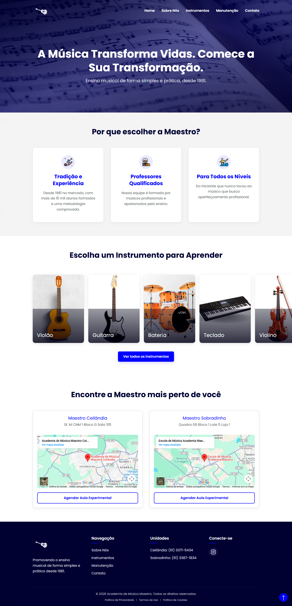
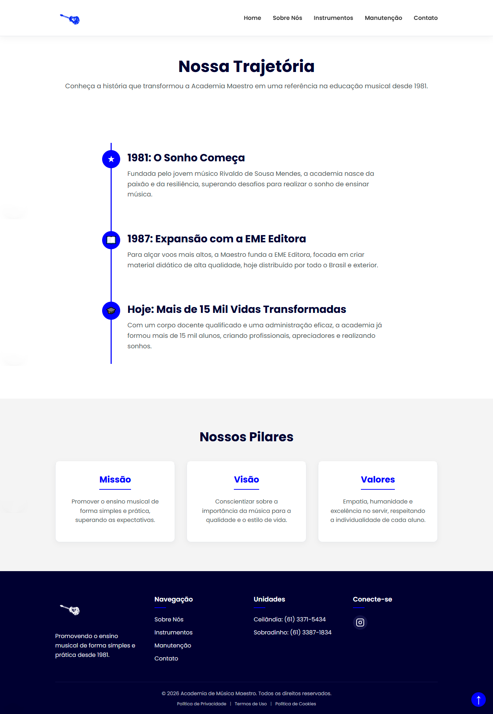
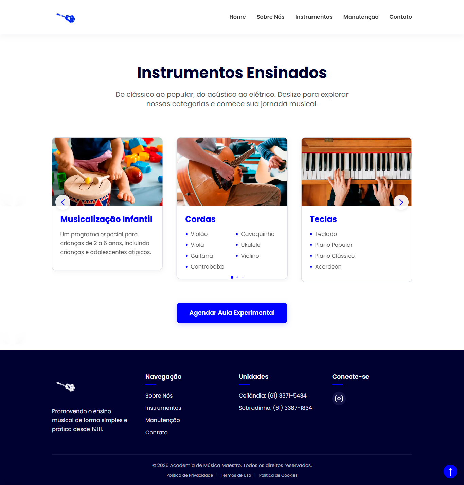
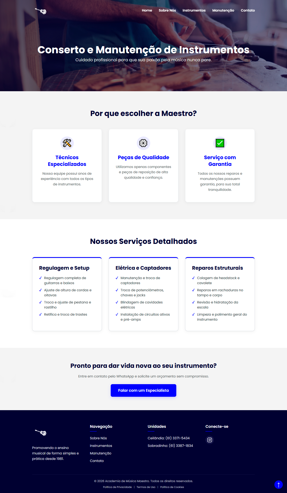
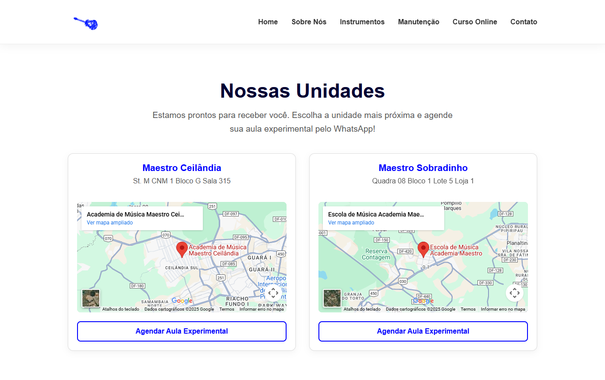

# 🎵 Academia de Música Maestro


## 📋 Descrição do Projeto

A **Academia de Música Maestro** é um site institucional moderno e responsivo desenvolvido para apresentar os serviços de ensino musical oferecidos pela escola desde 1981. O projeto foi construído com as mais recentes tecnologias web para proporcionar uma experiência de navegação fluida, rápida e otimizada para mecanismos de busca (SEO).

O site apresenta informações sobre os cursos de instrumentos musicais, localização das unidades em Ceilândia e Sobradinho (DF), serviços de manutenção de instrumentos, além de facilitar o contato com potenciais alunos através de integração com WhatsApp.

### 🎯 Problema que Resolve

- **Visibilidade Digital**: Proporciona presença online profissional para uma escola de música tradicional
- **Captação de Alunos**: Facilita o contato e agendamento de aulas experimentais
- **Informação Centralizada**: Reúne todas as informações importantes sobre cursos, unidades e serviços em um único lugar
- **Otimização para Buscas**: Implementa técnicas de SEO para melhorar o posicionamento nos mecanismos de busca

### ✨ Por que é Útil

- Interface moderna e intuitiva que transmite profissionalismo
- Performance otimizada com Next.js 15 (SSR/SSG)
- Totalmente responsivo para dispositivos móveis, tablets e desktops
- **Design System completo** com componentes reutilizáveis e documentados no Storybook
- **Testes abrangentes**: unitários (Jest) e E2E (Playwright) garantindo qualidade
- Integração com Google Analytics para análise de tráfego
- Conformidade com LGPD através de banner de cookies e políticas de privacidade

---

## 📸 Screenshots / Demonstração

### Home
 <!-- Insira aqui um print da tela inicial mostrando o hero section com o título principal -->

### Sobre Nós
 <!-- Insira aqui um print da página "Sobre Nós" mostrando a história da escola -->

### Instrumentos
 <!-- Insira aqui um print da página de instrumentos com o carrossel horizontal -->

### Manutenção
 <!-- Insira aqui um print da página de manutenção mostrando os serviços de luthieria -->

### Contato
 <!-- Insira aqui um print da página de contato mostrando os mapas das unidades -->

---

## 🚀 Funcionalidades Principais

### 🏠 Página Inicial
- **Hero Section**: Banner impactante com call-to-action
- **Seção "Por que escolher a Maestro?"**: Destaque para tradição, professores qualificados e metodologia
- **Preview de Instrumentos**: Carrossel horizontal infinito com animação suave
- **Banner de Curso Online**: Link direto para curso online "Violão Puro e Simples"
- **Mapa de Localização**: Visualização das unidades em Ceilândia e Sobradinho

### 🎸 Página de Instrumentos
- Apresentação detalhada dos cursos oferecidos
- Cards visuais para cada instrumento (violão, guitarra, bateria, teclado, violino, etc.)
- Informações sobre níveis e metodologia de ensino

### 📍 Página de Contato
- **Mapas Interativos**: Google Maps embutido para cada unidade
- **Integração WhatsApp**: Botões diretos para agendamento via WhatsApp
- Informações de endereço e telefone para ambas as unidades

### 🔧 Página de Manutenção
- Informações sobre serviços de luthieria
- Regulagem, reparos elétricos e estruturais
- Profissionalismo e qualidade no atendimento

### 📖 Páginas Institucionais
- **Sobre Nós**: História da escola desde 1981
- **Políticas**: Privacidade, Cookies e Termos de Uso (conformidade LGPD)

### 🎨 Design System
- **Componentes Base**: Button, Input, Text, Label, Heading, Alert, Badge, Spinner
- **Componentes Complexos**: Modal, Toast, Tooltip, Card, Accordion, Tabs, Form, Checkbox, Radio
- **Componentes de Layout**: Container, Stack, Grid
- **Sistema de Tokens**: Cores, tipografia, espaçamentos e animações padronizadas
- **Documentação no Storybook**: Todos os componentes documentados com exemplos e variações
- **Acessibilidade**: Componentes seguem padrões WCAG 2.1 AA

### 🧩 Componentes Reutilizáveis
- **Header Fixo**: Menu responsivo com efeito de transparência no topo da home
- **Footer Completo**: Links de navegação, redes sociais e informações legais
- **Cookie Banner**: Banner de consentimento para cookies (LGPD)
- **Botão "Voltar ao Topo"**: Navegação facilitada em páginas longas

### 🔍 SEO e Performance
- **Metadata Otimizado**: Títulos e descrições únicas para cada página
- **Dados Estruturados (Schema.org)**: Markup para MusicSchool
- **Sitemap.xml**: Geração automática do sitemap
- **Robots.txt**: Configuração para crawlers
- **Google Analytics**: Integração para análise de tráfego

### 🧪 Testes e Qualidade
- **Testes Unitários**: Cobertura completa de componentes, hooks e utilitários com Jest
- **Testes E2E**: Testes de integração com Playwright cobrindo fluxos críticos
- **Testes de Acessibilidade**: Validação de navegação por teclado, ARIA e semântica
- **Testes Cross-Browser**: Validação em Chromium, Firefox e WebKit
- **CI/CD Ready**: Configuração preparada para integração contínua

---

## 🛠️ Tecnologias Utilizadas

### Core Framework
- **[Next.js 15.5.2](https://nextjs.org/)**: Framework React com SSR, SSG e App Router
- **[React 19.1.0](https://react.dev/)**: Biblioteca JavaScript para construção de interfaces
- **[TypeScript 5.x](https://www.typescriptlang.org/)**: Superset JavaScript com tipagem estática

### Estilização
- **[Tailwind CSS 3.4](https://tailwindcss.com/)**: Framework CSS utility-first para desenvolvimento rápido e responsivo
- **CSS Global**: Variáveis CSS customizadas para cores e espaçamentos, além de animações customizadas

### Bibliotecas Auxiliares
- **[Swiper 11.2.10](https://swiperjs.com/)**: Biblioteca para carrosséis e sliders (preparado para uso futuro)
- **[glob 11.0.3](https://www.npmjs.com/package/glob)**: Busca de arquivos para geração dinâmica de sitemap
- **[clsx 2.1.1](https://github.com/lukeed/clsx)**: Utilitário para construção de classes CSS condicionais

### Ferramentas de Testes
- **[Jest 30.2.0](https://jestjs.io/)**: Framework de testes unitários
- **[React Testing Library](https://testing-library.com/react)**: Utilitários para testar componentes React
- **[Playwright 1.57.0](https://playwright.dev/)**: Framework para testes E2E e automação de navegadores
- **[@testing-library/jest-dom](https://github.com/testing-library/jest-dom)**: Matchers customizados para DOM

### Design System e Documentação
- **[Storybook 10.1.11](https://storybook.js.org/)**: Ferramenta para documentação e desenvolvimento de componentes
- **[@storybook/addon-a11y](https://storybook.js.org/addons/@storybook/addon-a11y)**: Addon para testes de acessibilidade no Storybook

### Ferramentas de Desenvolvimento
- **[ESLint 9.x](https://eslint.org/)**: Linter para qualidade de código
- **[Next.js ESLint Config](https://nextjs.org/docs/app/building-your-application/configuring/eslint)**: Configuração otimizada para Next.js
- **[eslint-plugin-storybook](https://github.com/storybookjs/eslint-plugin-storybook)**: Regras ESLint para Storybook

### Deploy e Containerização
- **Docker**: Dockerfile multi-stage para builds otimizados
- **Node.js 20**: Runtime JavaScript (Alpine Linux para imagens menores)

---

## 📦 Pré-requisitos

Antes de começar, certifique-se de ter instalado em sua máquina:

- **[Node.js](https://nodejs.org/)** (versão 20 ou superior)
- **[npm](https://www.npmjs.com/)** (geralmente vem com Node.js) ou **[Yarn](https://yarnpkg.com/)**
- **[Git](https://git-scm.com/)** para clonar o repositório
- (Opcional) **[Docker](https://www.docker.com/)** e **[Docker Compose](https://docs.docker.com/compose/)** para execução em containers

### Verificando as Instalações

```bash
node --version  # Deve retornar v20.x.x ou superior
npm --version   # Deve retornar 9.x.x ou superior
git --version   # Qualquer versão recente
```

---

## 🚀 Instalação e Execução

### 1. Clonar o Repositório

```bash
git clone https://github.com/seu-usuario/academia-maestro-next.git
cd academia-maestro-next
```

### 2. Instalar Dependências

```bash
npm install
```

Este comando irá instalar todas as dependências listadas no `package.json`, incluindo:
- Next.js, React e React DOM
- TypeScript e tipos
- Tailwind CSS, PostCSS e Autoprefixer
- Swiper
- ESLint e configurações

### 3. Executar em Modo de Desenvolvimento

```bash
npm run dev
```

O servidor de desenvolvimento será iniciado e você poderá acessar o site em:
**http://localhost:3000**

O Next.js possui hot-reload automático, então qualquer alteração nos arquivos será refletida imediatamente no navegador.

### 4. Build de Produção

Para gerar uma build otimizada para produção:

```bash
npm run build
```

Isso criará uma pasta `.next` com os arquivos otimizados e estáticos.

### 5. Executar Build de Produção Localmente

Após o build, você pode testar a versão de produção localmente:

```bash
npm start
```

O servidor de produção estará disponível em **http://localhost:3000**

### 6. Linting

Para verificar a qualidade do código:

```bash
npm run lint
```

### 7. Testes Unitários

Para executar os testes unitários:

```bash
# Executar todos os testes
npm test

# Modo watch (re-executa ao salvar arquivos)
npm run test:watch

# Com relatório de cobertura
npm run test:coverage

# Modo CI (sem watch, com saída simplificada)
npm run test:ci
```

### 8. Testes E2E (Playwright)

Para executar os testes de integração:

```bash
# Executar todos os testes E2E
npm run test:e2e

# Interface visual interativa
npm run test:e2e:ui

# Modo debug (abre Playwright Inspector)
npm run test:e2e:debug

# Modo headed (com navegador visível)
npm run test:e2e:headed

# Ver relatório HTML dos testes
npm run test:e2e:report

# Instalar navegadores do Playwright (primeira vez)
npm run test:e2e:install
```

### 9. Storybook

Para visualizar e desenvolver componentes no Storybook:

```bash
# Iniciar Storybook em modo desenvolvimento
npm run storybook

# Build estático do Storybook
npm run build-storybook
```

O Storybook estará disponível em **http://localhost:6006**

---

## 🐳 Executando com Docker

### Build da Imagem

```bash
docker build -t academia-maestro-next .
```

### Executar Container

```bash
docker run -p 3000:3000 academia-maestro-next
```

O site estará disponível em **http://localhost:3000**

### Docker Compose (Opcional)

Crie um arquivo `docker-compose.yml` na raiz:

```yaml
version: '3.8'

services:
  web:
    build: .
    ports:
      - "3000:3000"
    environment:
      - NODE_ENV=production
```

Execute com:

```bash
docker-compose up
```

---

## 📁 Estrutura do Projeto

```
academia-maestro-next/
│
├── public/                          # Arquivos estáticos (imagens, ícones)
│   ├── logo.png
│   ├── violao.jpg
│   ├── guitarra.webp
│   └── ...
│
├── src/
│   ├── app/                         # App Router do Next.js 15
│   │   ├── layout.tsx              # Layout raiz com Header, Footer e Google Analytics
│   │   ├── page.tsx                # Página inicial (Server Component)
│   │   ├── HomePageClient.tsx      # Componente cliente da home
│   │   ├── globals.css             # Estilos globais e variáveis CSS
│   │   │
│   │   ├── sobre/                  # Página "Sobre Nós"
│   │   │   ├── page.tsx
│   │   │   └── SobrePageClient.tsx
│   │   │
│   │   ├── instrumentos/           # Página de instrumentos
│   │   │   ├── page.tsx
│   │   │   └── InstrumentosPageClient.tsx
│   │   │
│   │   ├── contato/                # Página de contato
│   │   │   ├── page.tsx
│   │   │   └── ContatoPageClient.tsx
│   │   │
│   │   ├── manutencao/             # Página de manutenção
│   │   │   ├── page.tsx
│   │   │   └── ManutencaoPageClient.tsx
│   │   │
│   │   ├── politica-de-privacidade/
│   │   ├── termos-de-uso/
│   │   ├── politica-de-cookies/
│   │   │
│   │   ├── robots.ts               # Configuração do robots.txt
│   │   └── sitemap.ts              # Geração automática do sitemap.xml
│   │
│   ├── components/                  # Componentes reutilizáveis da aplicação
│   │   ├── Header.tsx              # Cabeçalho com menu responsivo
│   │   ├── Footer.tsx               # Rodapé com links e redes sociais
│   │   ├── CookieBanner.tsx         # Banner de consentimento de cookies
│   │   ├── GoogleAnalytics.tsx      # Integração com GA4
│   │   └── UnitsMap.tsx            # Componente de mapas das unidades
│   │
│   ├── design-system/               # Design System completo
│   │   ├── components/              # Componentes do Design System
│   │   │   ├── Button/             # Botão com variantes
│   │   │   ├── Input/              # Input e Textarea
│   │   │   ├── Modal/              # Modal/Dialog
│   │   │   ├── Toast/               # Notificações
│   │   │   ├── Card/                # Cards
│   │   │   └── ...                 # Outros componentes
│   │   ├── tokens/                  # Tokens de design
│   │   │   ├── colors.ts           # Cores
│   │   │   ├── typography.ts       # Tipografia
│   │   │   └── spacing.ts          # Espaçamentos
│   │   ├── hooks/                   # Hooks customizados
│   │   │   ├── useModal.ts         # Hook para modais
│   │   │   ├── useToast.ts         # Hook para toasts
│   │   │   └── ...                 # Outros hooks
│   │   ├── utils/                   # Utilitários
│   │   │   └── cn.ts               # Helper para classes CSS
│   │   └── README.md                # Documentação do Design System
│   │
│   └── stories/                      # Stories do Storybook
│       ├── *.stories.tsx            # Stories dos componentes
│       └── GettingStarted.mdx       # Documentação inicial
│
├── test/                             # Testes unitários
│   └── unit/                         # Testes unitários organizados
│       ├── components/               # Testes de componentes
│       ├── hooks/                    # Testes de hooks
│       ├── utils/                    # Testes de utilitários
│       ├── helpers/                  # Helpers de teste
│       └── mocks/                    # Mocks e fixtures
│
├── e2e/                              # Testes E2E (Playwright)
│   ├── specs/                       # Especificações de teste
│   │   ├── navegacao-completa.spec.ts
│   │   ├── header-interacoes.spec.ts
│   │   ├── acessibilidade-interacoes.spec.ts
│   │   └── ...                     # Outros testes
│   ├── pages/                       # Page Objects
│   │   ├── BasePage.ts
│   │   ├── HomePage.ts
│   │   └── ...                     # Outros page objects
│   ├── fixtures/                    # Fixtures do Playwright
│   ├── utils/                       # Utilitários de teste
│   └── README.md                    # Documentação dos testes E2E
│
├── docs/                             # Documentação do projeto
│   ├── fase-*.md                    # Fases de implementação
│   ├── design-system/               # Documentação do Design System
│   └── e2e-testing-guide.md         # Guia de testes E2E
│
├── .storybook/                       # Configuração do Storybook
│   ├── main.ts
│   └── preview.ts
│
├── tailwind.config.ts                # Configuração do Tailwind CSS
├── postcss.config.js                # Configuração do PostCSS
├── jest.config.js                    # Configuração do Jest
├── playwright.config.ts              # Configuração do Playwright
│
├── .next/                            # Build de produção (gerado automaticamente)
├── node_modules/                     # Dependências (gerado automaticamente)
│
├── Dockerfile                        # Configuração Docker multi-stage
├── next.config.ts                    # Configurações do Next.js
├── tsconfig.json                     # Configurações do TypeScript
├── eslint.config.mjs                 # Configurações do ESLint
├── package.json                      # Dependências e scripts
└── README.md                         # Este arquivo
```

### 📝 Explicação das Pastas Principais

- **`src/app/`**: Utiliza o App Router do Next.js 15. Cada subpasta representa uma rota, e `page.tsx` é o componente da página. A separação entre Server Components (`page.tsx`) e Client Components (`*PageClient.tsx`) otimiza performance e SEO.

- **`src/components/`**: Componentes React reutilizáveis específicos da aplicação (Header, Footer, CookieBanner, etc.). Todos os componentes que usam hooks do React ou interatividade são marcados com `'use client'`.

- **`src/design-system/`**: Design System completo com componentes reutilizáveis, tokens de design, hooks customizados e utilitários. Todos os componentes são documentados no Storybook e seguem padrões de acessibilidade.

- **`test/unit/`**: Testes unitários organizados por tipo (components, hooks, utils, helpers, mocks). Utiliza Jest e React Testing Library para garantir qualidade e cobertura de código.

- **`e2e/`**: Testes end-to-end com Playwright. Inclui page objects, fixtures e utilitários para testes de integração que validam fluxos completos do usuário.

- **`docs/`**: Documentação completa do projeto, incluindo fases de implementação, guias do Design System e documentação de testes.

- **`public/`**: Arquivos estáticos servidos diretamente pelo Next.js. Imagens, ícones e outros assets são referenciados com caminhos absolutos começando com `/`.

- **`tailwind.config.ts`**: Configuração do Tailwind CSS com tema customizado, cores, fontes e animações.
- **`postcss.config.js`**: Configuração do PostCSS com plugins do Tailwind CSS e Autoprefixer.
- **`jest.config.js`**: Configuração do Jest para testes unitários.
- **`playwright.config.ts`**: Configuração do Playwright para testes E2E.

---

## 📄 Licença

Este projeto é **privado** e de propriedade da **Academia de Música Maestro**. Todos os direitos reservados.

---

## 👤 Cliente

**Academia de Música Maestro**

- **Fundador**: Rivaldo de Sousa Mendes
- **Fundação**: 1981
- **Website**: [www.academiademusicamaestro.com.br](https://www.academiademusicamaestro.com.br)
- **Instagram**: [@academiamaestroceilandia](https://www.instagram.com/academiamaestroceilandia/)

### 📞 Contato

**Unidade Ceilândia**
- Endereço: St. M CNM 1 Bloco G Sala 315, Ceilândia - DF
- Telefone: (61) 3371-5434
- WhatsApp: (61) 99639-2573

**Unidade Sobradinho**
- Endereço: Quadra 08 Bloco 1 Lote 5 Loja 1, Sobradinho - DF
- Telefone: (61) 3387-1834
- WhatsApp: (61) 98317-1825

---

## 💻 Desenvolvimento

Este site foi desenvolvido como **prestação de serviço** por:

**Jonata Jesus**
- **Função**: Desenvolvedor Front-End
- **Especialização**: Desenvolvimento Web Moderno com React, Next.js e TypeScript
- **Projeto**: Site institucional da Academia de Música Maestro

### 🎯 Sobre o Desenvolvimento

O projeto foi desenvolvido utilizando as mais modernas tecnologias e melhores práticas do mercado:

- **Framework**: Next.js 15 com App Router para performance otimizada
- **Interface**: React 19 com TypeScript para código robusto e tipado
- **Estilização**: Tailwind CSS para design responsivo e moderno
- **Design System**: Componentes padronizados e documentados no Storybook
- **Qualidade**: Testes unitários e E2E garantindo robustez e confiabilidade
- **SEO**: Otimização completa para mecanismos de busca
- **Performance**: SSR/SSG para carregamento rápido e melhor experiência do usuário
- **Acessibilidade**: Componentes seguem padrões WCAG 2.1 AA
- **Conformidade**: Implementação de LGPD com políticas de privacidade e cookies
- **Analytics**: Integração com Google Analytics 4 para análise de tráfego

### 🚀 Entregáveis

- ✅ Site institucional completo e responsivo
- ✅ 5 páginas principais (Home, Sobre, Instrumentos, Contato, Manutenção)
- ✅ 3 páginas de políticas (Privacidade, Cookies, Termos de Uso)
- ✅ **Design System completo** com componentes documentados no Storybook
- ✅ **Testes unitários** com alta cobertura (Jest + React Testing Library)
- ✅ **Testes E2E** cobrindo fluxos críticos (Playwright)
- ✅ Componentes reutilizáveis e modulares
- ✅ Integração com Google Maps para localização das unidades
- ✅ Integração com WhatsApp para contato direto
- ✅ Sistema de SEO com sitemap e robots.txt
- ✅ Docker para deploy facilitado
- ✅ Documentação técnica completa

---

**Desenvolvido com ❤️ por Jonata Jesus usando Next.js, React e TypeScript**

